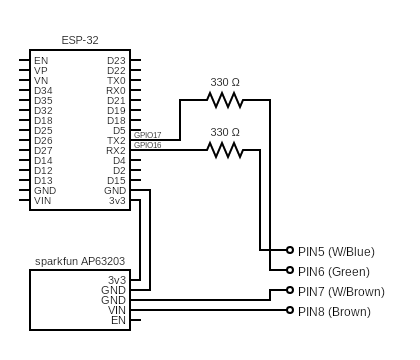
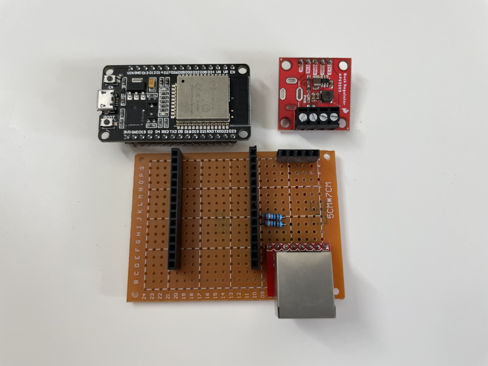
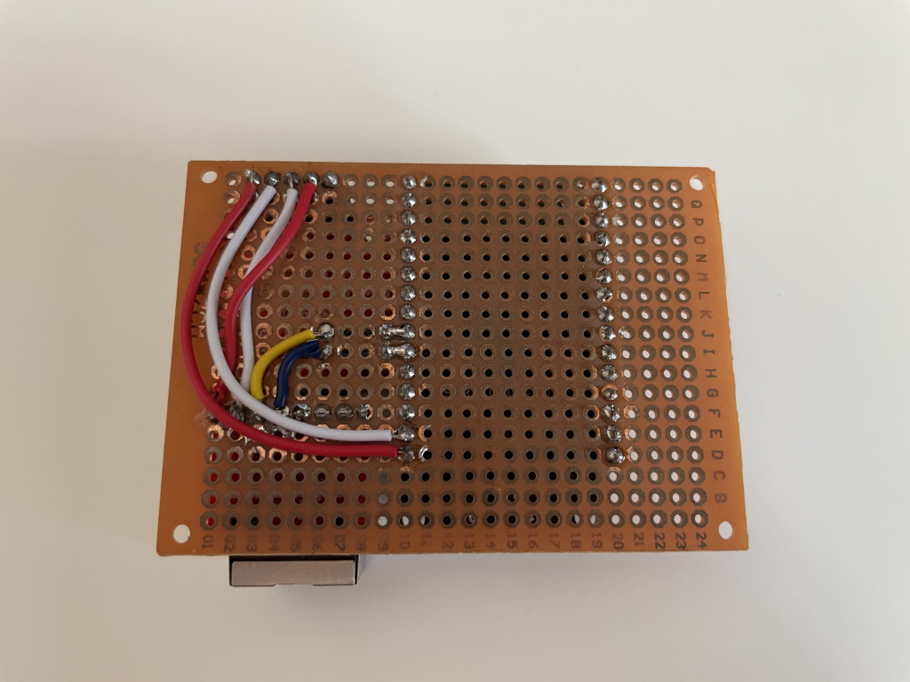
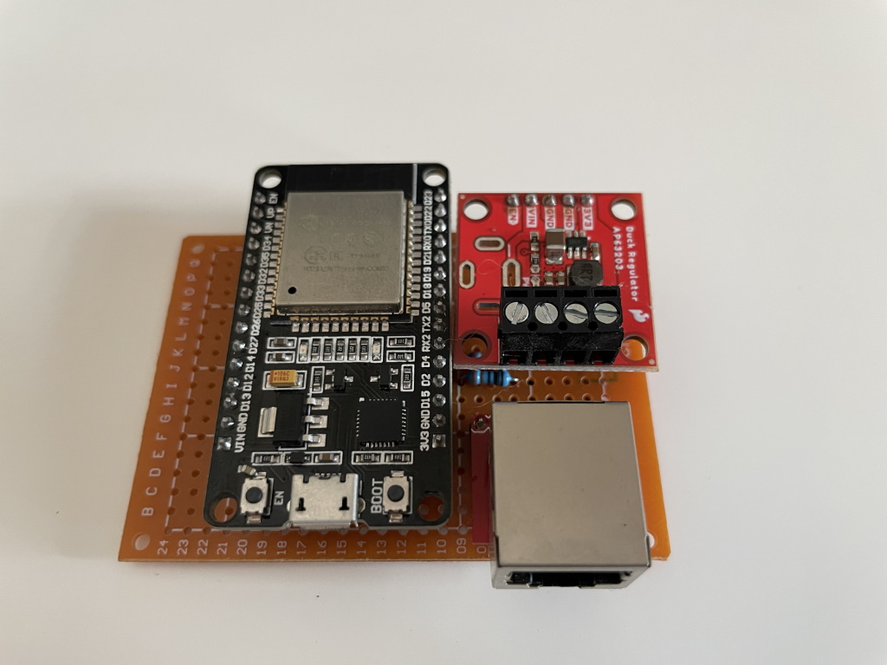

# Hardware Docs

This directory contains any general-purpose documentation related to the way in which this spa hardware works, as well as the hardware we build to interface with the spa pool controller.

## Interfacing with the spa pool

On spa pools containing SV and SV Mini controllers, there exists a port labeled `EXP1` or `EXPAND1` port. This is a standard RJ-45 plug, with the following output coming from the controller on each of the pins:

| Pin | Controller | WiFly Adapter       |
|-----|------------|---------------------|
| 1   | Health Led | Pass through        |
| 2   | GND        | Pass through        |
| 3   | Not used   |                     |
| 4   | Not used   |                     |
| 5   | TX         | RX (PIN45 on wifly) |
| 6   | RX         | TX (PIN46 on wifly) |
| 7   | GND        | GND                 |
| 8   | 12V        | 12V                 |

Because the spa is outputting 12V over this connection, we can build our controller with no need for an external power connection - all we need to do is convert the 12V down to a 3.3V voltage suitable for our ESP32 chip.

## Building the hardware

Perhaps in the future we will offer a custom-built solution, but for now you're going to have to get your hands dirty to build out your own piece of hardware. Below we will outline the components you need, as well as how to connect everything together.

> Note: If you lack the confidence to build the hardware yourself, if you want to ask questions, or if you just want to check if anyone near to you already has some components lying around, join the [team discord server](https://discord.gg/faK8Ag4wHn) and introduce yourself!

### Components

The table below lists a few options for purchasing the required components. [AliExpress](https://aliexpress.com) is typically cheaper but has a much slower delivery, compared with the more expensive [Core Electronics](https://core-electronics.com.au/) (based in Australia), with their faster delivery times.

| Component        | Store links | Comments |
|------------------|-------------|----------|
| ESP32            | [AliExpress](https://www.aliexpress.com/item/1005001929935550.html?spm=a2g0o.order_list.0.0.74be1802hFqod2) / [Core](https://core-electronics.com.au/firebeetle-esp32-e-iot-microcontroller-with-header-supports-wi-fi-bluetooth.html) | Get 1 already-wielded ESP32. |
| RJ45 connector   | [AliExpress](https://www.aliexpress.com/item/1005003717285471.html?spm=a2g0o.order_list.0.0.74be1802hFqod2) / [Core](https://core-electronics.com.au/sparkfun-rj45-magjack-breakout.html) | Get a 'H Type+DIP Pins'. |
| Buck converter   | [AliExpress](https://www.aliexpress.com/item/1005002603013499.html?spm=a2g0o.order_list.0.0.74be1802hFqod2) / [Core](https://core-electronics.com.au/sparkfun-babybuck-regulator-breakout-3-3v-ap63203.html) | Get a '5-40V to 3.3V' converter. |
| 330 ohm Resistor | [AliExpress](https://www.aliexpress.com/item/32952657927.html?spm=a2g0o.order_list.0.0.74be1802hFqod2) / [Core](https://core-electronics.com.au/resistor-330-ohm-1-6th-watt-pth.html) | You need two 330 ohm resistors (not to be confused with 330K ohm). |

Beyond these key components, you may want to buy some protoboards, breadboards, pin headers, cables, etc to build your device. Some useful links include:

| Component | Store links | Comments |
|-----------|-------------|----------|
| Pin Headers | [AliExpress](https://www.aliexpress.com/item/32724478308.html?spm=a2g0o.order_list.0.0.74be1802hFqod2) | |
| Perfboard | [AliExpress](https://www.aliexpress.com/item/1005003422520490.html?spm=a2g0o.order_list.0.0.74be1802hFqod2) | If you want to solder your hardware together. |

### Assembly Images

To keep things as simple as possible, off the shelf modules have been used.
NOTE: The resitors on the RX/TX pins are recommended but optional.

